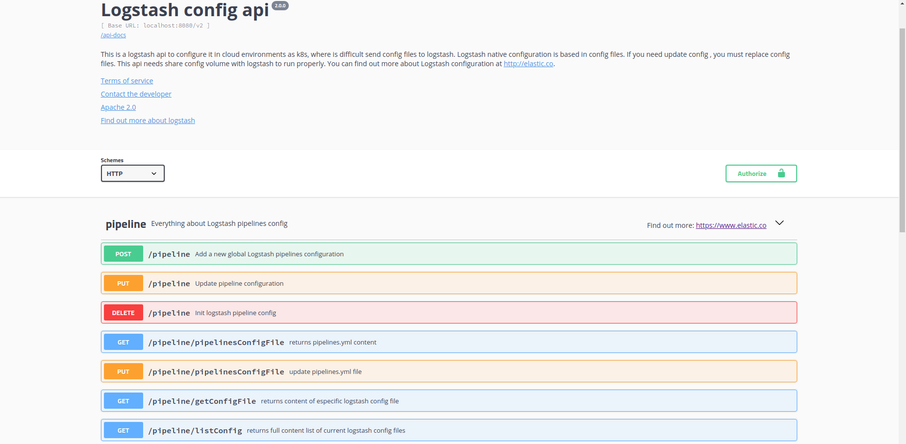

# Logstash Configuration API Server



## Overview
Part of this api server code  was generated by the [swagger-codegen](https://github.com/swagger-api/swagger-codegen) project.  By using the [OpenAPI-Spec](https://github.com/OAI/OpenAPI-Specification) from a remote server, you can easily generate a server stub.

This code allows configure [logstash](https://www.elastic.co/es/products/logstash) via RESTful API.This is useful in cloud environments as k8s where is difficult send configuration files. Use [Swagger UI](http://localhost:8080/docs) to retreive all endpoints. Currently this api supports multiple-pipelines and patterns configuration.

To perform configuration operations `AUTH_BASIC` is required. Default credentials are `elastic/changeme` but can be overwritten setting `ELASTIC_USERNAME` & `ELASTIC_PASSWORD` ENV variables visibles to api server process.


### Running the server
To run the server, run:

```
npm start
```

To view the Swagger UI interface:

```
open http://localhost:8080/docs
```

This project leverages the mega-awesome [swagger-tools](https://github.com/apigee-127/swagger-tools) middleware which does most all the work.

### Testing api with standalone Logstash installation

* Download logstash from [elastic website](https://www.elastic.co/es/downloads/logstash)
* Set `LOGSTASH_CONFIG_PATH` ENV variable  visible to logstash process  & pointing to logstash main config dir (default `/usr/share/logstash/config`)
* Optional: change default credentials (elastic/changeme) setting following ENV variables:
  * `ELASTIC_USERNAME`
  * `ELASTIC_PASSWORD`  
* API process needs this folders inside logstash config dir to run properly:
  * `patterns` : for patterns files
  * `pipeline` : for pipelines conf.
* Start logstash process with auto reloading config feature (`--config.reload.automatic`)
* Start api process `npm start`  from main folder of this project.
* Test api via [Swagger UI](http://localhost:8080/docs). Remember set credentials in Swagger UI, otherwise api returns `400` code.

### Testing logstash api with docker

* run command `docker build --tag api-logstash .` from root folder of this project
* run `docker-compose up` command from `docker-compose` folder inside `examples` folder.
* Test api via [Swagger UI](http://localhost:8080/docs). Remember set credentials in Swagger UI, otherwise api returns `400` code.Default credentials are `elastic/changeme`. You can overwrite default credentials setting `ELASTIC_USERNAME` & `ELASTIC_PASSWORD` env variables with desired values.

### Testing logstash api with minikube

You can deploy logstash configuration api as **sidecar pattern** or singular statefulset,  sharing the configuration persistent volume claim  with Logstash Pod. For more information you can review [k8s doc](https://kubernetes.io/docs/concepts/workloads/pods/pod-overview/)

For simplicity we provide a Logstash chart in this example. [helm][https://helm.sh/] is required to test this sample in minikube or k8s. 

* run `make` commmand inside `examples/minikube` folder to install logstash & configuration api in sidecar pattern mode.
* logstash configuration api is accesible from `ls-dev-logstashapi01-svc` nodeport service. You can retreive url executing `sudo minikube service ls-dev-logstashapi01-svc --url` command. this service nodeport exposes by default 9500 (logstash config api port) and 9600 (native logstash api stat port) ports.
* by default we use storageClass "standard" for Dynamic provision storage. You can change this default value setting custom chart values file: 

```
config:
  dynamicProvision: true
  accessModes: [ "ReadWriteMany" ]
  storageClassName: "standard"
  resources:
    request:
      storage: 1Mi
```
to apply cutom configuration execute `helm upgrade --wait --timeout=600 --install --values your_values_file.yml charts/logstash-1.0.0.tgz` from `examples/minikube` folder.


Uninstall process: run `make purge` from `examples/minikube` dashboard.


